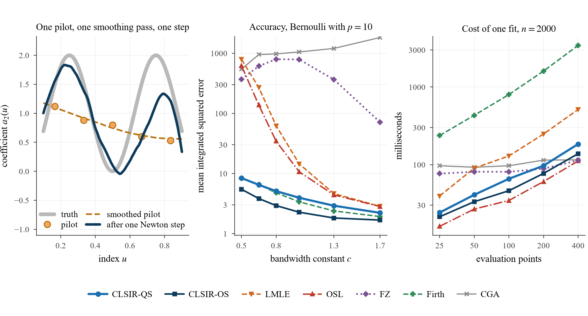

# CLSIR — one-step estimation for generalized varying-coefficient models

**Calibrated local sliced inverse regression**: an initial value that every evaluation point computes on its own, so a single Newton step replaces the iterated local likelihood fit — without a sequential recursion, without tying the resolution of the fitted curve to the sample size, and without needing a finite local maximizer.



*Left: the pilot is deliberately crude — a handful of two-parameter fits, smoothed once — and a single Newton step recovers the coefficient function. Middle and right: accuracy and cost against six competitors, on a Bernoulli design with ten covariates.*

---

## The idea in one paragraph

In a generalized varying-coefficient model the coefficient functions are usually estimated by a local likelihood fit, iterated afresh at every point at which a coefficient is evaluated. One Newton step removes those iterations, but it needs an initial value, and the standard construction gets one by propagating a converged fit along the grid. That recursion is sequential, its grid has to shrink with the sample size, and a single window in which the likelihood has no finite maximizer — for a binary response, a window whose two classes are linearly separable — damages every point downstream of it.

Hold the index fixed and the response depends on the covariates through a single linear combination. A kernel weighted **sliced inverse regression** therefore recovers the *direction* of the coefficient vector from conditional moments alone: no iteration, no maximization, and nothing that can diverge. A generalized linear model in **two** unknowns along that direction supplies the sign, scale and intercept the direction leaves undetermined, and one local quadratic smoothing pass turns the resulting curve into the level and derivative a Newton step needs. That pass also returns a curvature, which is exactly the initial value a local *quadratic* step needs — so a second estimator comes free.

| | |
|---|---|
| **CLSIR-OS** | one Newton step in the local **linear** parametrization |
| **CLSIR-QS** | one Newton step in the local **quadratic** one, from the same pilot |

Both attain the bias, asymptotic variance and limit distribution of the corresponding fully iterated estimator.

---

## Quick start

```bash
pip install -r requirements.txt
```

```python
import numpy as np
from clsir.clsir_core import LocalIndex, fit_clsir_os, slice_labels

# u: index in [0, 1];  x: design matrix with a leading column of ones;  y: response
idx  = LocalIndex(u, x, y, slice_labels(y, "binomial", 2))
grid = np.linspace(0.10, 0.90, 101)

os_fit = fit_clsir_os(idx, grid, h=0.12, family="binomial")                  # CLSIR-OS
qs_fit = fit_clsir_os(idx, grid, h=0.12, family="binomial", quadratic=True)  # CLSIR-QS

os_fit.estimate          # (101, p+1) array of fitted coefficients
```

`family` is `"binomial"`, `"poisson"` or `"gaussian"`. The only tuning constants are the pilot ratio and the smoothing ratio, and both have defaults; the pilot ratio is set by the response family, because a Bernoulli observation carries at most a quarter of a unit of Fisher information about the linear predictor while a count carries its mean, so a binary response needs a wider pilot window to reach the same precision.

---

## Reproducing the paper

Every number, table and figure comes from these scripts. Raw Monte Carlo output runs to a few hundred megabytes and is not committed; `scripts/` regenerates it.

| Step | Command | Produces |
|---|---|---|
| 1 | `pwsh scripts/run_v4.ps1` | the bandwidth grid, six designs, two sample sizes, 500 replications |
| 2 | `sh scripts/run_v5_rest.sh` | fitted curves, cross-validated analysis, cost, the data application |
| 3 | `sh scripts/run_v5_timing.sh` | every wall-clock measurement, re-taken on an idle machine |
| 4 | `sh scripts/run_v6.sh` | interval coverage, size and power of the constancy test |
| 5 | `python clsir/make_figures.py` | all fourteen figures |
| 6 | `python clsir/numbers_v3.py` | every number the text quotes, in one place |

Anything whose result is a wall-clock time must run alone — a six-worker pool elsewhere on the machine changes the numbers.

### What is in each module

| File | What it does |
|---|---|
| `clsir/clsir_core.py` | the estimator: SIR direction, two-parameter calibration, smoothing pass, Newton step |
| `clsir/clsir_study.py` | Monte Carlo driver for the bandwidth grid, the cross-validated analysis and the cost study |
| `clsir/verify_theory.py` | numerical checks of the rates and constants in the theory |
| `clsir/coverage_study.py` | coverage of the two pointwise intervals, every design |
| `clsir/power_study.py` | size and power of the constancy test |
| `clsir/tuning_wide.py` | the pilot-ratio sweep behind the family default |
| `clsir/real_data.py` | the South African heart disease analysis |
| `clsir/make_figures.py` | every figure |
| `clsir/build_*.py` | the LaTeX tables |

`figures/` and `tables/` hold the versions that appear in the paper, so the output can be compared without re-running anything.

---

## Data

`data/SAheart.data` — coronary heart disease in 462 men from a high-risk region of the Western Cape, from Rousseauw et al. (1983) and distributed with *The Elements of Statistical Learning* (Hastie, Tibshirani and Friedman). It is redistributed here unchanged, for reproduction; the source is <https://hastie.su.domains/ElemStatLearn/>.

The simulated designs are generated from seeds fixed in `clsir/clsir_study.py`, so every table reproduces exactly.

---

## Requirements

Python 3.10 or later, with `numpy`, `scipy`, `pandas` and `matplotlib`. The studies parallelize over processes and assume each worker is restricted to a single linear-algebra thread; the run scripts set that.

---

## Citation

> Wang, X. Calibrated local sliced inverse regression for one-step estimation in generalized varying-coefficient models. Working paper.

---

## License

Code released under the MIT License (see `LICENSE`). The data file is redistributed under the terms of its original source.
